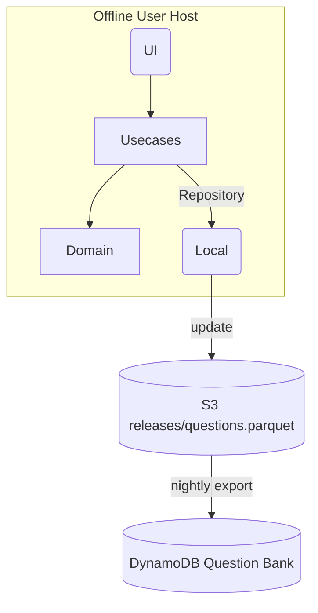

# システム要件定義書 — *aws‑cp‑cli*

（AWS 認定クラウドプラクティショナー模擬試験 CLI アプリ）

---

## 1. 目的

* AWS 認定クラウドプラクティショナー（CLF‑C02）受験者が **オフライン環境**で模擬試験と演習を行うための CLI ツールを提供し、学習効率と合格率を高める。
* コアを **Clean Architecture** で実装し、将来の Web／モバイル UI 拡張を容易にする。
* オープンソース (MIT or Apache‑2.0) として GitHub に公開し、コミュニティ貢献を促進する。

---

## 2. 背景・課題

| 現状の課題                                | 解決イメージ                                         |
| ------------------------------------ | ---------------------------------------------- |
| 模擬試験サービスは Web 依存が多く、**オフライン学習が困難**   | Parquet で配布する問題バンクをローカルにキャッシュ                  |
| 無償の PDF 問題集は更新が遅く、**試験範囲とのギャップ**が大きい | DynamoDB の最新データを夜間エクスポート → S3 → CLI で `update` |
| 問題ソースがブラックボックスで**著作権リスク**            | OSS リポジトリでレビュー＆履歴管理                            |

---

## 3. 用語定義

| 用語                   | 説明                                        |
| -------------------- | ----------------------------------------- |
| **Question Bank**    | DynamoDB に保存された問題・解説データ                   |
| **Parquet Snapshot** | Point‑in‑Time Export により S3 に配置された列指向ファイル |
| **Exam Mode**        | 本番同等 (65 問 / 90 分) の模擬試験機能                |
| **Practice Mode**    | ドメイン・件数を指定して短時間演習                         |
| **Stats Mode**       | ローカルに保存した成績の閲覧・分析                         |
| **SME**              | Subject‑Matter Expert（AWS 有資格レビュー担当者）     |

---

## 4. 利用者

| 利用者       | スキル     | 目的               |
| --------- | ------- | ---------------- |
| 初学者エンジニア  | AWS 未経験 | 試験範囲を最短で把握し合格したい |
| インフラ初任担当  | 基礎レベル   | 通勤中や自宅でスキマ学習したい  |
| コントリビューター | 中上級     | 問題追加・コード改善に参加したい |

---

## 5. システム概要

* **CLI (Node.js 20+)** がローカル Parquet を読み込み、模擬試験を提供
* `aws-cp-cli update` で S3 上の最新スナップショットをダウンロード
* DynamoDB → S3 エクスポートは GitHub Actions 経由で自動実行

---

## 6. 機能要求（Functional Requirements）

| ID        | 要件                                                      | 優先度 |
| --------- | ------------------------------------------------------- | :-: |
| **FR‑01** | *Exam Mode* — 65 問をランダムに出題し、タイマーと残数を表示しながら解答を受け付ける      |  ★  |
| **FR‑02** | *Practice Mode* — `--domain` と `--count` で演習範囲を限定できる    |  ★  |
| **FR‑03** | *Update Mode* — S3 から `questions.parquet` を取得しローカルに保存する |  ★  |
| **FR‑04** | *Stats Mode* — 過去のスコア・正答率・苦手ドメインを一覧表示                   |  ★  |
| **FR‑05** | 日本語 / 英語の問題を自動選択 (`--lang`)                             |  ☆  |
| **FR‑06** | 設定ファイル (`~/.aws‑cp‑cli/config.json`) で既定言語・保存先を変更       |  ☆  |
| **FR‑07** | `--help` または不正オプション入力時に豊富なヘルプを表示                        |  ★  |
| **FR‑08** | 試験完了後に正解・解説をレビューできる                                     |  ★  |
| **FR‑09** | 試験中に Ctrl‑C で中断した場合、再開 or 終了を選択                         |  ☆  |
| **FR‑10** | Windows, macOS, Linux の主要シェルで動作                         |  ★  |

---

## 7. 非機能要求（Non‑Functional Requirements）

| カテゴリ       | 要件                                                  |
| ---------- | --------------------------------------------------- |
| **性能**     | Parquet 5 000 問読み込み < **1 秒**（M1 Mac/Win i5 相当）     |
| **可用性**    | オフライン時でも既存問題で動作。更新失敗時は前回キャッシュを維持                    |
| **信頼性**    | 試験実行中のクラッシュ率 < **0.1 %**                            |
| **セキュリティ** | 外部送信は `update` 時の S3 GET のみ。個人データはローカル保存            |
| **移植性**    | Node.js **v20.0.0 以上**で OS 依存ライブラリなし                |
| **保守性**    | Clean Architecture 準拠、各レイヤ 80 %+ 単体テストカバレッジ         |
| **国際化**    | UI メッセージは i18n JSON で抽象化                            |
| **パッケージ**  | `npm` / `npx` / `pnpm dlx` いずれもサポート、サイズ < **15 MB** |

---

## 8. データ要件

| 要素               | 要件                                                                                                                  |
| ---------------- | ------------------------------------------------------------------------------------------------------------------- |
| **Problem Data** | DynamoDB → Parquet 変換時に `id`, `lang`, `domain`, `stem`, `choices` (JSON), `answer`, `explanation`, `updatedAt` 列を含む |
| **Local Cache**  | 既定: `~/.aws‑cp‑cli/questions.parquet`                                                                               |
| **Result Log**   | JSON Lines (`results.log`) 形式で試験結果を追記。Schema: `{ timestamp, mode, score, correct, total, domainStats }`             |

---

## 9. 外部インターフェース要件

| 区分           | 要件                                                                                             |
| ------------ | ---------------------------------------------------------------------------------------------- |
| **CLI I/O**  | `prompts` (選択肢)／標準出力（ANSI 色付き）                                                                 |
| **ネットワーク**   | `https://aws-cp-question-bank.s3.amazonaws.com/releases/latest/questions.parquet` への HTTPS GET |
| **ファイル I/O** | Parquet 読み取り (`parquetjs`)、JSON 書き込み (`fs/promises`)                                           |
| **API**      | なし（v1 時点）                                                                                      |

---

## 10. 制約条件

1. Parquet ライブラリは **純粋 TypeScript/JS** 実装を採用し、ネイティブアドオンを避ける
2. オープンソースで公開できない **公式試験問題**は取り扱わない
3. 開発は **public GitHub** で行い、Issue/PR をオープンに管理
4. 全プラットフォームで **同一コードベース**をビルドし、OS 別分岐を最小化
5. テストフレームワークは **Vitest**、モックは `ts-mockito` を使用

---

## 11. 前提条件・依存関係

| No. | 内容                                              |
| --- | ----------------------------------------------- |
| P‑1 | DynamoDB エクスポートの AWS アカウント／IAM 権限を確保済み          |
| P‑2 | S3 静的バケットが公開 or 署名付き URL で GET 可能               |
| P‑3 | GitHub Actions 実行ランナーに AWS CLI / credentials 設定 |
| P‑4 | 利用者 PC に Node.js ≥ 20 がインストールされている              |
| P‑5 | CLI コマンドライン環境（PowerShell/Bash/Zsh）が利用可能         |

---

## 12. 移行・導入計画

| フェーズ        | 内容                                   |
| ----------- | ------------------------------------ |
| **α 版**     | core & exam mode 実装、サンプル問題 10 問を同梱   |
| **β 版**     | Parquet 更新機能・本番 65 問フロー、成績保存         |
| **RC**      | SME が 300 問検証、Windows/macOS/Linux 確認 |
| **v1.0**    | npm 公開、README 日本語/英語整備               |
| **Post v1** | コミュニティからの問題追加・i18n 強化                |

---

## 13. 受け入れ基準

1. `npx aws-cp-cli exam` が 65 問テストを完走し、結果が正しく表示・保存される
2. `npx aws-cp-cli update` 実行時、ネットワーク障害を除き 100 % 成功する
3. Windows 10/11、macOS 12+、Ubuntu 22.04 で同一バイナリが動作
4. 初回起動から試験開始まで 5 秒以内（ネットワーク更新除く）
5. README にインストール・使用方法・FAQ が記載されている

---

## 14. 変更履歴

|  版  | 日付         | 変更者     | 変更内容 |
| :-: | ---------- | ------- | ---- |
| 0.1 | 2025‑05‑04 | ChatGPT | 初版作成 |

---

次のドキュメント **「3. 開発コスト」** へ進みましょうか？ ご要望があればお知らせください。
