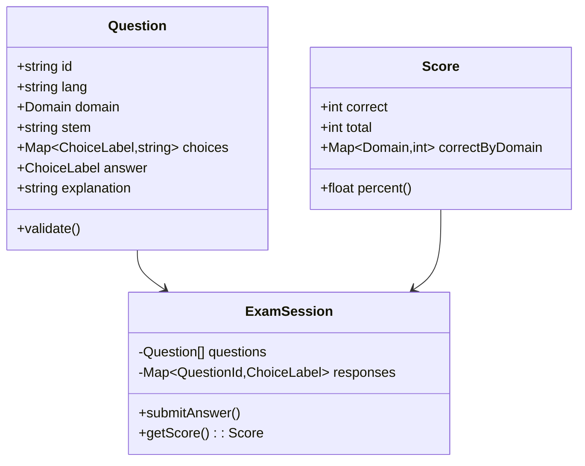
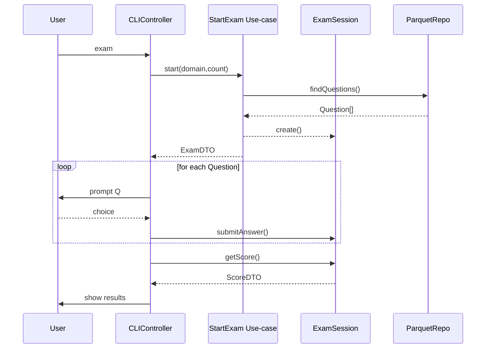

# システム設計書 — *aws‑cp‑cli*

（AWS 認定クラウドプラクティショナー模擬試験 CLI アプリ）

---

## 0. 位置づけ

* **目的**：システム要件定義書 §6 “機能要求” を実装するための具体的な設計指針を示す。
* **読者**：プロジェクト開発者・コントリビューター・SME・QA 担当。

---

## 1. 全体アーキテクチャ

```mermaid
flowchart LR
  subgraph Inner Ring (Enterprise Rules)
    Domain[Domain Layer<br>(Entities / VOs)]
    Usecases[Use‑case Layer]
    Domain --> Usecases
  end
  subgraph Outer Ring (Interface Adapters)
    CLIUI[CLI UI (prompts)]
    Presenter[Presenter]
    Repo[QuestionRepository<br>(Parquet / File)]
    Logger[Logger]
    CLIUI --> Presenter --> Usecases
    Usecases --> Repo
    Usecases --> Logger
  end
  subgraph Infra & Frameworks
    ParquetJS[parquetjs]
    FS[fs/promises]
    S3Client[@aws-sdk/client-s3]
    Repo --> ParquetJS & FS
    CLIUI -.-> Chalk[(chalk)]
    UpdateCmd[update command] --> S3Client
    Stats[stats command] --> FS
  end
```

* **依存の方向**は常に内向き（外側→内側）。
* UI / 保存方式を差し替えても **Domain+Use‑case** は無変更。

---

## 2. レイヤ詳細

| レイヤ                   | 主なモジュール                                                                                         | 責務                        | 外部依存                          |
| --------------------- | ----------------------------------------------------------------------------------------------- | ------------------------- | ----------------------------- |
| **Domain**            | `Question`, `Choice`, `ExamSession`, `Score`, `DomainError`                                     | ビジネスルールの根幹。検証ロジック・不変条件    | なし                            |
| **Use‑case**          | `StartExam`, `SubmitAnswer`, `FinishExam`, `UpdateQuestions`, `GetStats`                        | アプリケーション固有ルール。トランザクション境界  | リポジトリ抽象・Presenter 抽象          |
| **Interface‑Adapter** | `CLIController`, `ResultPresenter`, `ParquetQuestionRepo`, `FileQuestionRepo`, `JsonStatsStore` | 入出力変換、DTO ↔️ Entity マッピング | prompts, chalk, parquetjs, fs |
| **Infra / Framework** | `parquetjs`, `@aws-sdk/client-s3`, `fs`, `os`, `path`, `commander`                              | フレームワーク・OS・クラウド SDK       | NPM パッケージ                     |

---

## 3. データモデル

### 3.1 クラス図（簡略）



### 3.2 Parquet スキーマ

| 列             | 型                         | Null | 説明                  |
| ------------- | ------------------------- | :--: | ------------------- |
| `id`          | BYTE\_ARRAY (UTF8)        |   N  | 質問ID                |
| `lang`        | BYTE\_ARRAY (UTF8)        |   N  | `jp` / `en`         |
| `domain`      | BYTE\_ARRAY (UTF8)        |   N  | `cloud_concepts` など |
| `stem`        | BYTE\_ARRAY (UTF8)        |   N  | 問題文                 |
| `choices`     | BYTE\_ARRAY (UTF8)        |   N  | JSON 文字列            |
| `answer`      | BYTE\_ARRAY (UTF8)        |   N  | `"A"`               |
| `explanation` | BYTE\_ARRAY (UTF8)        |   Y  | 解説                  |
| `updatedAt`   | INT64 (TIMESTAMP\_MILLIS) |   N  |                     |

---

## 4. 主要フロー

### 4.1 Exam フロー（SequenceDiagram）



### 4.2 Update フロー

1. `update` コマンド起動
2. `@aws-sdk/client-s3` で `HEAD` → `ETag` 比較
3. 差分ありなら `GET` → 一時ファイルへ書込
4. 書込完了後、既存ファイルへ原子置換（`fs.rename`）
5. 成功ログ保存 → 終了コード 0

---

## 5. エラーハンドリング方針

| 層           | 例外                                 | 対応                                     |
| ----------- | ---------------------------------- | -------------------------------------- |
| Domain      | `DomainError`（バリデーション失敗）           | Use‑case に伝搬、CLI でメッセージ表示              |
| Use‑case    | `NotFoundError`, `RepositoryError` | Presenter 経由でユーザー通知                    |
| CLI / Infra | ネットワーク失敗, I/O Error                | 再試行（update は 3 回） or graceful fallback |

---

## 6. ロギング & テレメトリー

* **ログレベル**：`info`, `warn`, `error`（JSON Lines）
* デフォルト出力先：`~/.aws‑cp‑cli/logs/YYYY-MM-DD.log`
* CLI オプション `--verbose` でデバッグログ追加。
* 遠隔送信なし（プライバシー重視）。

---

## 7. 設定ファイル

```jsonc
// ~/.aws-cp-cli/config.json
{
  "lang": "jp",
  "dataDir": "~/.aws-cp-cli",
  "s3": {
    "bucket": "aws-cp-question-bank",
    "prefix": "releases/latest",
    "file": "questions.parquet",
    "region": "ap-northeast-1"
  }
}
```

* 環境変数 `AWS_CP_CLI_CONFIG` でパス上書き可。
* Node ランタイムが自動で `~` を展開（`os.homedir()`).

---

## 8. セキュリティ設計

| 項目        | 方針                                        |
| --------- | ----------------------------------------- |
| 通信        | HTTPS のみ。S3 GET はパブリックオブジェクト or 署名付き URL  |
| データ保護     | 個人成績はローカル保存のみ。暗号化は不要（CLI 所有者 = 利用者）       |
| 依存パッケージ監査 | GitHub Dependabot + `npm audit` CI で自動 PR |
| サプライチェーン  | `npm package signing` v1 対応を計画（将来）        |

---

## 9. テスト戦略

| レイヤ      | ツール                                                                 | カバレッジ目標 |
| -------- | ------------------------------------------------------------------- | ------- |
| Domain   | Vitest                                                              | 90 %    |
| Use‑case | Vitest + ts‑mockito                                                 | 85 %    |
| CLI UI   | E2E：`zx` + `expect` で対話自動化                                          | 試験主要経路  |
| Cross‑OS | GitHub Actions matrix (ubuntu-latest, windows-latest, macos-latest) | smoke   |

---

## 10. デプロイ & リリース

| 項目      | 内容                                                      |               |
| ------- | ------------------------------------------------------- | ------------- |
| CI      | GitHub Actions：`pnpm test` → `pnpm build` → `pnpm pack` |               |
| パッケージ公開 | `npm publish --access public`（semver                    | commit ‑lint） |
| タグ付け    | `v1.0.0`, `v1.0.1` …                                    |               |
| リリースノート | Conventional Commits → `changesets` で自動生成               |               |

---

## 11. 今後の拡張ポイント

1. **Web UI**：Next.js フロントを `interface-adapter/web` に追加
2. **Mobile**：React Native Expo で UI 差し替え
3. **Question GQL API**：AppSync/GraphQL サーバーレイヤを外側に配置
4. **スペースドリピティション**：`ReviewScheduler` Use‑case を追加

---

## 12. 変更履歴

|  版  | 日付         | 変更者     | 内容 |
| :-: | ---------- | ------- | -- |
| 0.1 | 2025‑05‑04 | ChatGPT | 初版 |

---

次は **6. アーキテクチャデザイン**（コードレベルの依存逆転図 & DI 設計）または **7. ロバストネス分析** に進むことができます。ご指定ください！
